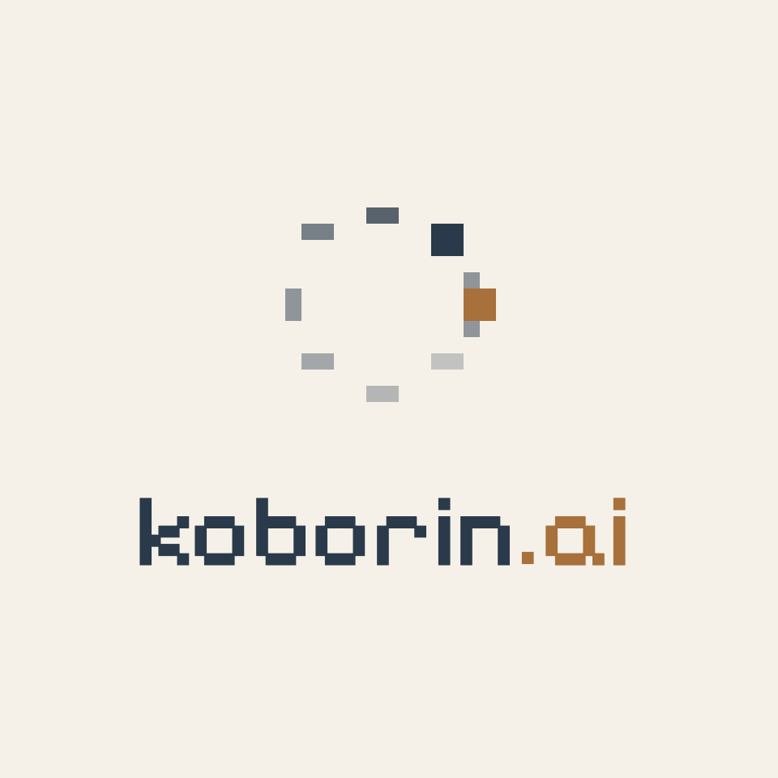

# brand

<p align="center">
  <picture>
    <source media="(prefers-color-scheme: dark)" srcset="./lockup/pixel/png/transparent/stacked@2x.png">
    
  </picture>
</p>

The Single Source of Truth for `koborin-ai`'s visual identity.

A reference point for myself, AI, and the people who collaborate with this org. Contains icon assets, lockups, color palette, typography, and tone & voice — all derived from the philosophy below.

## Philosophy

`koborin-ai` is a personal org rooted in a way of living: shaping oneself through repeated cycles of *hypothesize → verify → return*. Reading, music, and warm baths keep the loop steady, while I myself am a single trembling light — carrying delicacy and unsteadiness. Spinning the loop together with the people I care about and with AI, life becomes richer — a small place where light orbits quietly, still pulsing in this very moment.

## 8 lights orbiting

The icon is a single picture of the cycle.

The **8 nodes** are the steady inputs that fuel each turn of *hypothesize → verify → return*: code, music, reading, warm baths, dialogue, and the people I share these with. They sit in a closed orbit because the cycle is closed — each loop hands off to the next.

The **gold node** is me, mid-cycle. While the 8 hold the structure, the gold one moves: brighter or dimmer depending on which question I'm sitting with, never quite settling. It's the present moment of the loop — the only part that pulses.

## Structure

```text
brand/
├── icon/                 # Master icon (3 variants × multiple PNG sizes)
│   ├── icon.svg          # transparent master
│   ├── icon-on-dark.svg
│   ├── icon-on-light.svg
│   └── png/{transparent,on-dark,on-light}/{16..1024}.png
├── lockup/               # Icon + wordmark
│   ├── pixel/            # A primary (Pixelify Sans)
│   └── modern/           # B secondary (Geist Sans)
├── preview/              # Browser-viewable live preview
├── process/              # Exploration archive: rejected variants & lessons
├── CLAUDE.md             # Context for LLMs
└── .claude/skills/       # Project-local skill: render-brand
```

## Quick reference

### Colors

- Primary `#7fb4ca` crystalBlue / Bg `#181616` (dark) / `#f5f1e8` (light)
- Accent `#c4b28a` gold (on dark) / `#a8703a` copper (on light)

### Fonts

- A primary: **Pixelify Sans** — face, hero, OG, avatar
- B secondary: **Geist Sans** — body, UI, formal contexts

### Voice

- Quiet, honest, retro-playful, co-creative

## Usage

Live preview:

```bash
open preview/index.html
```

Regenerate PNGs (auto via the `render-brand` skill, or directly):

```bash
bash .claude/skills/render-brand/scripts/render-icons.sh
bash .claude/skills/render-brand/scripts/render-lockups.sh
```

For LLM context, include [`CLAUDE.md`](./CLAUDE.md). The `render-brand` skill is auto-discovered from `.claude/skills/`.
